# 📧 ResumeMailer-AI

<div align="center">


**AI-powered bulk resume emailing system that personalizes job applications at scale**

[🚀 Live Demo](https://resumemailer-ai.onrender.com) • [📖 Documentation](#-documentation) • [🤝 Contributing](#-contributing) • [🐛 Report Bug](https://github.com/utsav31703/ResumeMailer-AI/issues)

</div>

---

## 🌟 Overview

ResumeMailer-AI revolutionizes the job application process by combining the power of AI with automated email sending. Upload your resume and a CSV of HR contacts, and let our AI generate personalized emails that get noticed.

### ✨ Key Features

🔐 **Secure Gmail Integration** - OAuth2 authentication for safe email access  
📊 **Smart CSV Processing** - Upload HR contact lists with ease  
📄 **Multi-format Resume Support** - Handles PDF and DOCX files  
🤖 **AI-Powered Personalization** - Gemini AI crafts tailored emails  
👀 **Email Preview** - Review before sending  
🚀 **Bulk Email Sending** - Scale your job applications efficiently  

---

## 🎯 How It Works

```mermaid
graph LR
    A[🔑 Google Login] --> B[📊 Upload CSV]
    B --> C[📄 Upload Resume]
    C --> D[🤖 AI Generation]
    D --> E[👀 Preview Emails]
    E --> F[📧 Send Bulk]
    F --> G[✅ Success!]
```



1. **Authenticate** with your Google account
2. **Upload** your HR contact CSV file
3. **Upload** your resume (PDF/DOCX)
4. **Generate** AI-personalized emails
5. **Preview** each email before sending
6. **Send** bulk emails with optional resume attachment

---

## 🛠️ Tech Stack

<table>
<tr>
<td>

**Backend**
- Node.js
- Express.js
- Passport.js

</td>
<td>

**AI & APIs**
- Google Gemini API
- Gmail API
- OAuth2

</td>
<td>

**File Processing**
- csv-parser
- pdf-parse
- mammoth

</td>
</tr>
</table>

---

## 🚀 Quick Start

### Prerequisites

- Node.js (v14 or higher)
- npm or yarn
- Google Cloud Console account
- Gemini AI API key

### Installation

1. **Clone the repository**
   ```bash
   git clone https://github.com/utsav31703/ResumeMailer-AI.git
   cd ResumeMailer-AI
   ```

2. **Install dependencies**
   ```bash
   npm install
   ```

3. **Environment setup**
   
   Create a `.env` file in the root directory:
   ```env
   PORT=5000
   SESSION_SECRET=your_super_secret_key
   GOOGLE_CLIENT_ID=your_google_client_id
   GOOGLE_CLIENT_SECRET=your_google_client_secret
   GEMINI_API_KEY=your_gemini_api_key
   ```

4. **Google Cloud Console setup**
   
   - Enable Gmail API in your Google Cloud Console
   - Create OAuth 2.0 credentials
   - Add redirect URI: `http://localhost:5000/auth/google/callback`
   - Download credentials and add to your `.env` file

5. **Start the application**
   ```bash
   npm run dev
   ```
   
   The app will be available at `http://localhost:5000`

---

## 📋 CSV Format Example

Your HR contacts CSV should follow this format:

```csv
name,email
John Doe,john@company.com
Jane Smith,jane@startup.co
Mike Johnson,mike@enterprise.org
```

---

## 🔌 API Reference

### Base URL
```
https://resumemailer-ai.onrender.com
```

### Authentication Endpoints
| Method | Endpoint | Description |
|--------|----------|-------------|
| `GET` | `/auth/google` | Initiate Google OAuth login |
| `GET` | `/auth/google/callback` | Handle OAuth callback |
| `GET` | `/auth/logout` | Logout user |

### Core Endpoints
| Method | Endpoint | Description |
|--------|----------|-------------|
| `POST` | `/upload-csv` | Upload HR contacts CSV |
| `POST` | `/upload-resume` | Upload resume (PDF/DOCX) |
| `POST` | `/generate-mail` | Generate personalized email |
| `POST` | `/preview-mails` | Preview all generated emails |
| `POST` | `/send-bulk` | Send bulk emails |

### Example API Usage

```javascript
// Generate personalized email
const response = await fetch('/generate-mail', {
  method: 'POST',
  headers: {
    'Content-Type': 'application/json'
  },
  body: JSON.stringify({
    contact: {
      name: "Jane Smith",
      email: "jane@company.com"
    },
    resumeData: {
      // Extracted resume data
      skills: ["JavaScript", "Node.js", "React"],
      experience: "3 years in web development"
    }
  })
});
```

---

## 🎨 Screenshots

<div align="center">


</div>

---

## 🚧 Roadmap

- [ ] **Enhanced AI Models** - Integration with multiple AI providers
- [ ] **React Frontend** - Modern dashboard with real-time updates
- [ ] **Email Templates** - Pre-built professional templates
- [ ] **Analytics Dashboard** - Track email open rates and responses
- [ ] **Scheduling** - Schedule emails for optimal sending times
- [ ] **A/B Testing** - Test different email variations
- [ ] **Integration APIs** - Connect with job boards and CRMs

---

## 🤝 Contributing

We love contributions! Here's how you can help:

1. **Fork** the repository
2. **Create** a feature branch (`git checkout -b feature/amazing-feature`)
3. **Commit** your changes (`git commit -m 'Add some amazing feature'`)
4. **Push** to the branch (`git push origin feature/amazing-feature`)
5. **Open** a Pull Request

### Development Guidelines

- Follow the existing code style
- Write meaningful commit messages
- Add tests for new features
- Update documentation as needed

---

## 📄 License

This project is licensed under the MIT License - see the [LICENSE](LICENSE) file for details.

---

## 🙏 Acknowledgments

- [Google Gemini AI](https://ai.google.dev/) for powerful AI capabilities
- [Gmail API](https://developers.google.com/gmail/api) for email functionality
- [Node.js](https://nodejs.org/) community for excellent libraries

---

## 📞 Support

<div align="center">

**Having issues or questions?**

[](https://github.com/utsav31703/ResumeMailer-AI/issues)
[](https://github.com/utsav31703/ResumeMailer-AI/stargazers)

[Create an Issue](https://github.com/utsav31703/ResumeMailer-AI/issues/new) • [Email Support](mailto:your-email@example.com) • [Documentation](https://github.com/utsav31703/ResumeMailer-AI/wiki)

</div>

---

<div align="center">

**Made with ❤️ by [Utsav Kushwaha](https://github.com/utsav31703)**

*Don't forget to ⭐ this repo if it helped you!*

</div>
